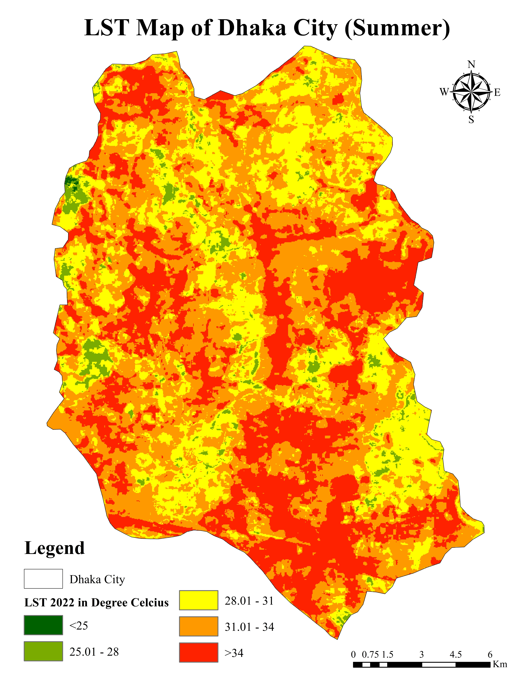
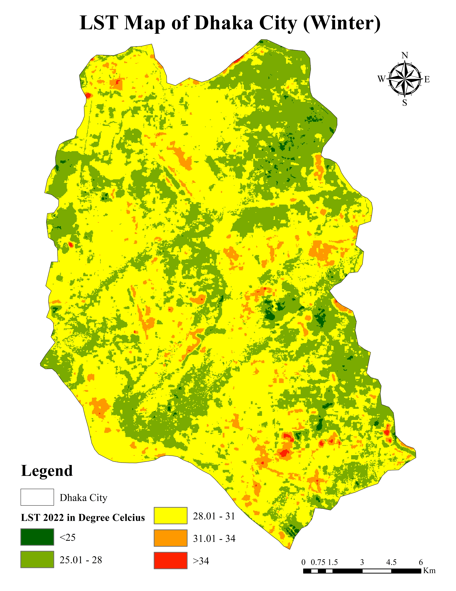
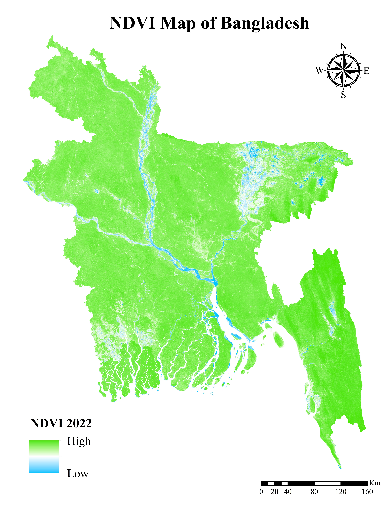
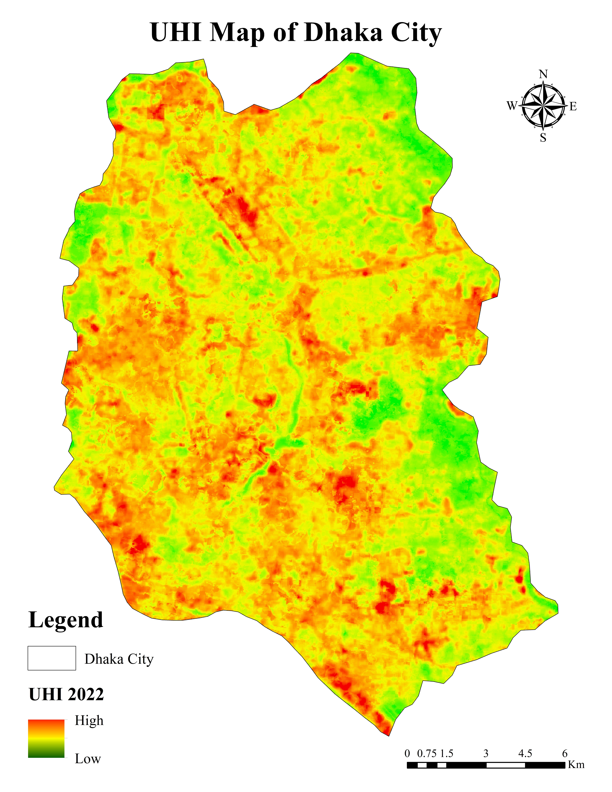
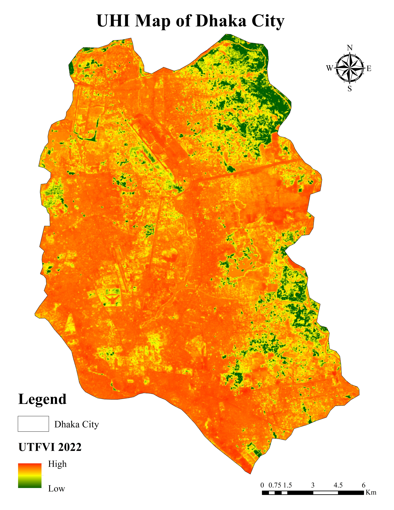
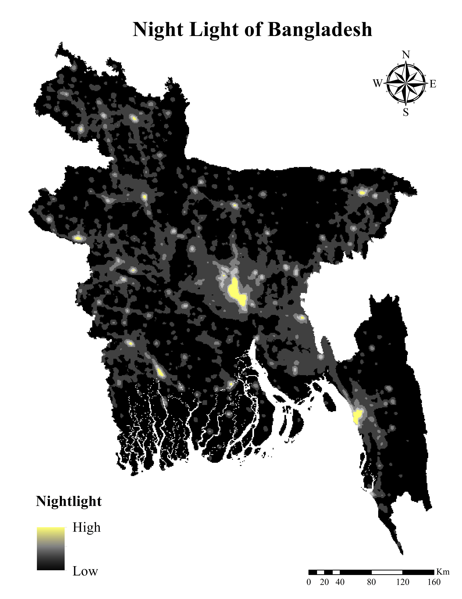
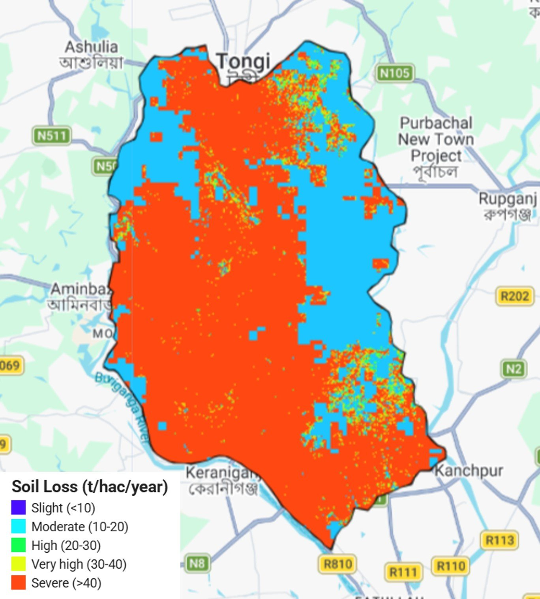

# Urban Environmental Analysis (2022) — Google Earth Engine

Google Earth Engine (GEE) scripts and derived output maps for analyzing land
surface temperature, vegetation, urban heat, nighttime lights, and soil loss
over the Dhaka / Bangladesh region using 2021–2022 satellite data.

### `scripts/`
Google Earth Engine JavaScript scripts (run in the [GEE Code Editor](https://code.earthengine.google.com/)).
Each script expects an `ROI` (Region of Interest) geometry/FeatureCollection
to be defined in the Code Editor before running (either drawn manually or
imported as an asset), and the LULC classification script additionally
expects `Water`, `Buildup`, `Vegetation`, and `Bareland` training-sample
FeatureCollections.

| Script | Description |
|---|---|
| `LST.js` | Land Surface Temperature (Summer composite) from Landsat 8 thermal band, using NDVI-derived emissivity correction. |
| `NDVI.js` | Normalized Difference Vegetation Index from Landsat 8 surface reflectance. |
| `LULC.js` | Land Use / Land Cover classification (Water, Built-up, Vegetation, Bareland) using a CART classifier, with accuracy assessment. |
| `UHI.js` | Urban Heat Island index, normalized from LST (mean/std-dev of the ROI). |
| `UTFVI.js` | Urban Thermal Field Variance Index, derived from LST and UHI. |
| `Nightlight.js` | DMSP-OLS stable nighttime lights composite (multi-year comparison + median). |
| `Soil_Loss.js` | Soil loss estimate using the RUSLE model (Rainfall, Soil erodibility, Slope-Length, Cover, and Practice factors), with per-subbasin area statistics. |

### `outputs/`
Exported map images (rendered from the Code Editor / Drive exports):

**Land Surface Temperature — Summer 2022**

Script: [`scripts/LST.js`](scripts/LST.js)

**Land Surface Temperature — Winter 2022**

Script: [`scripts/LST.js`](scripts/LST.js)

**NDVI — 2022**

Script: [`scripts/NDVI.js`](scripts/NDVI.js)

**Urban Heat Island Index — 2022**

Script: [`scripts/UHI.js`](scripts/UHI.js)

**Urban Thermal Field Variance Index — 2022**

Script: [`scripts/UTFVI.js`](scripts/UTFVI.js)

**Nighttime Lights Composite**

Script: [`scripts/Nightlight.js`](scripts/Nightlight.js)

**Soil Loss (RUSLE) — 2021–2022**

Script: [`scripts/Soil_Loss.js`](scripts/Soil_Loss.js)

## Data Sources

- **Landsat 8 Collection 2, Level 2 (Surface Reflectance / Surface Temperature)** — `LANDSAT/LC08/C02/T1_L2`
- **CHIRPS Pentad Precipitation** — `UCSB-CHG/CHIRPS/PENTAD`
- **OpenLandMap Soil Texture Class** — `OpenLandMap/SOL/SOL_TEXTURE-CLASS_USDA-TT_M/v02`
- **SRTM Digital Elevation Model** — `USGS/SRTMGL1_003`
- **Sentinel-2** — `COPERNICUS/S2`
- **MODIS Land Cover Type** — `MODIS/061/MCD12Q1`
- **DMSP-OLS Nighttime Lights** — `NOAA/DMSP-OLS/NIGHTTIME_LIGHTS`
- **FAO GAUL Administrative Boundaries** — `FAO/GAUL/2015/level0`

## Usage

1. Open the [Google Earth Engine Code Editor](https://code.earthengine.google.com/).
2. Create/import your `ROI` geometry (and training sample FeatureCollections
   for `LULC.js`).
3. Copy the contents of the desired script from `scripts/` into the Code
   Editor and run.
4. Use the `Export.image.toDrive` task at the bottom of each script to export
   results to Google Drive.

## License

See [LICENSE](LICENSE).
